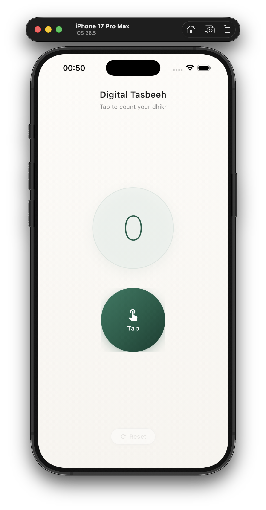
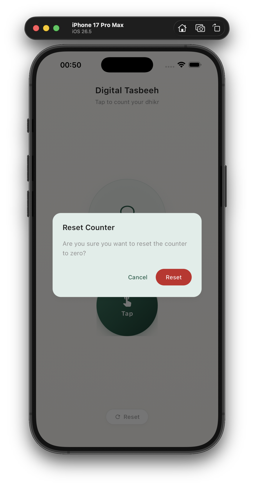

# Digital Tasbeeh

A simple, modern **Digital Tasbeeh** (Islamic prayer counter) built with Flutter.

The app provides a single-screen experience for counting dhikr with smooth animations, persistent storage, and a calm visual design.

## Features

- Large, animated counter in the center of the screen
- Tap button with ripple effect and haptic feedback
- Reset with confirmation dialog
- Counter persistence using `SharedPreferences`
- Responsive layout for portrait and landscape
- Clean Architecture with Cubit, GetIt, and Repository pattern

## Application Screenshots

Screenshots are ordered by the app user flow.

| Step | Screen | File |
|------|--------|------|
| 1 | Home / Counter | `screenshots/01-home-counter.png` |
| 2 | Reset Confirmation | `screenshots/02-reset-confirmation-dialog.png` |

### 1. Home / Counter

<p align="center">
  
</p>

<p align="center"><em>Main screen — title, counter at zero, Tap button, and Reset action.</em></p>

### 2. Reset Confirmation

<p align="center">
  
</p>

<p align="center"><em>Reset confirmation dialog — asks before clearing the counter to zero.</em></p>

## Architecture

```
lib/
├── core/
│   ├── constants/
│   ├── di/
│   └── theme/
├── features/
│   └── tasbeeh/
│       ├── data/
│       │   ├── datasources/
│       │   └── repositories/
│       ├── domain/
│       │   ├── entities/
│       │   └── repositories/
│       ├── cubit/
│       └── presentation/
│           ├── pages/
│           └── widgets/
└── main.dart
```

### Layers

| Layer | Responsibility |
|-------|----------------|
| **Domain** | Entities and repository contracts |
| **Data** | SharedPreferences data source and repository implementation |
| **Presentation** | Cubit with sealed states, UI widgets, and page |

## Getting Started

### Prerequisites

- Flutter SDK (3.3.4 or later)
- Dart SDK
- Android Studio / Xcode (for mobile builds)

### Installation

```bash
cd digital_tasbeeh
flutter pub get
```

### Run the App

```bash
flutter run
```

### Analyze & Test

```bash
flutter analyze
flutter test
```

## Usage

1. Open the app — the counter loads the last saved value.
2. Tap the large **Tap** button to increment the counter.
3. Tap **Reset** to clear the counter (confirmation required).

## Tech Stack

- **Flutter** — UI framework
- **flutter_bloc** — State management (Cubit)
- **get_it** — Dependency injection
- **shared_preferences** — Local persistence
- **equatable** — State comparison

## Assets

- `assets/icons/app_icon.png` — App launcher icon
- `assets/icons/tasbeeh_beads.svg` — Tasbeeh beads illustration
- `screenshots/` — Application screenshots for documentation

## License

This project is created for educational and personal use.
